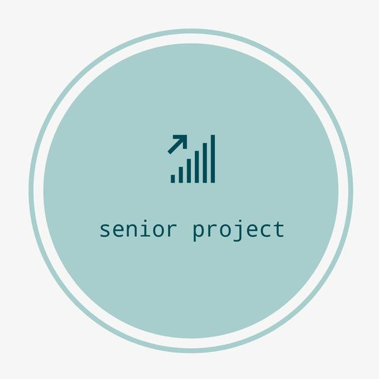

<h1 align="center">
  Instagram analyzing tool️
</h1>
<p align="center">
  
</p>

## Updates

* App is still in development
* Weekly updates of the code

## Motivation
<p>
  Due to the enormous amount of negativity in Instagram, we decided to provide an app that will diminish the hateful comments from other users and take measures to prevent it. In other words, we want to make Instagram a more safe platform for everyone. This will be done by analyzing comments, direct messages to find negative, positive, neutral comments and give opportunity to delete negative comments and block users that wrote that.
</p>

## Stack

* React js
* Typescript
* Sliced-design methodology
* Chakra UI
* Effector state manager
* Jest - for testing
* Graph API, Message API - to retrieve data from Instagram page


## Implemented features
* Login in to Facebook page
* Retrieving information from Instagram page (Post data, post comments, bio etc.)
* Semantic search of all comments with Graph API
* Analysis of post comments
* Reply, delete comment functions

## Feature features
* Connection of Message API to retrieve Instagram page direct messages


## Usage

```bash
# installation
$ yarn

# development mode
# it automatically opens `http://localhost:8080` in your default browser
$ yarn dev

# check typing
$ yarn check-typing

# production build
$ yarn build

# production mode
$ yarn start
```
